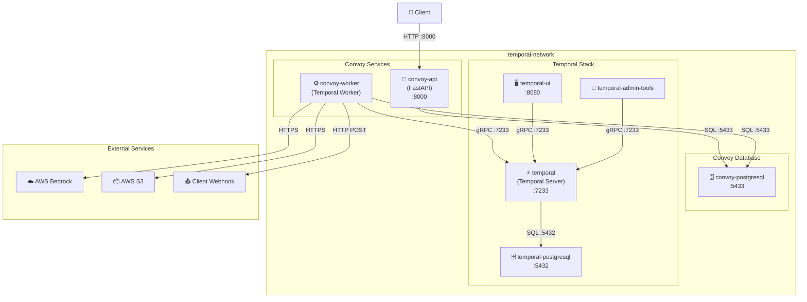
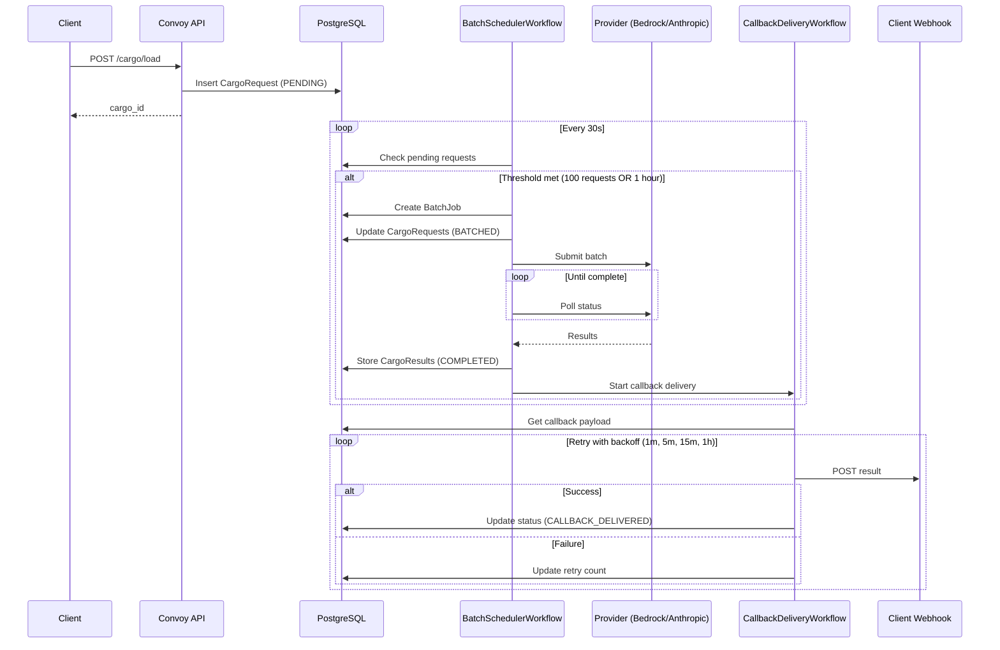
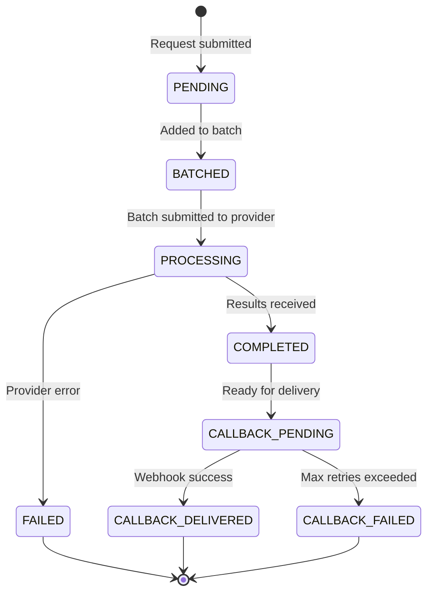
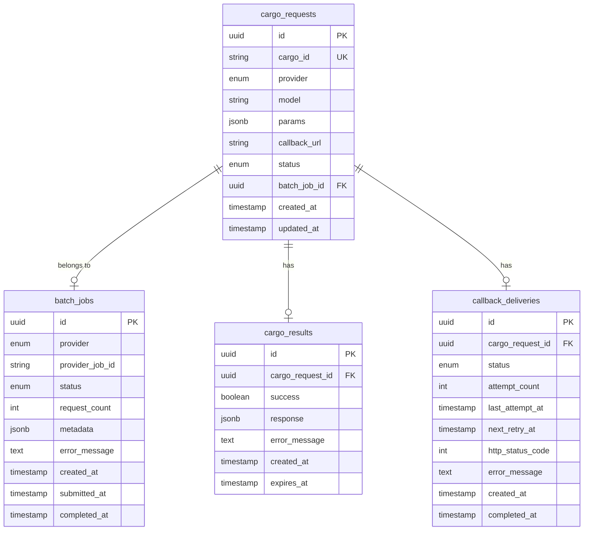

# Architecture

Convoy is a distributed batch processing system built with a microservices architecture. It uses Temporal for workflow orchestration, PostgreSQL for persistence, and supports multiple AI providers (AWS Bedrock, Anthropic) for batch inference.

## System Architecture

## Data Flow

## Cargo Status Lifecycle

## Database Schema

## Core Components

### Convoy API (FastAPI)

The REST API layer that handles incoming requests:

| Endpoint | Description |
|----------|-------------|
| `POST /cargo/load` | Submit prompts for batch processing |
| `GET /cargo/{id}/tracking` | Track the status of submitted cargo |
| `GET /health` | Health check endpoint |

### Services Layer

- **CargoLoaderService** - Persists incoming requests to the database with status `PENDING`
- **CargoTrackerService** - Retrieves cargo status and tracking information
- **BatchProcessingService** - Manages batch jobs across multiple providers

### Temporal Worker

Executes workflows and activities for batch processing orchestration:

**Workflows:**

| Workflow | Description |
|----------|-------------|
| `BatchSchedulerWorkflow` | Long-running workflow (one per provider) that monitors pending requests, creates batches when thresholds are met, submits to providers, and triggers callbacks |
| `CallbackDeliveryWorkflow` | Delivers results to client webhooks with exponential backoff retry (1min → 5min → 15min → 1hr) |
| `ResultCleanupWorkflow` | Periodic cleanup of expired results (default: 30 days) |

### Batch Processor Adapters

Provider-specific implementations for batch inference:

| Adapter | Description |
|---------|-------------|
| `BedrockBatchProcessor` | AWS Bedrock batch inference via S3 |
| `AnthropicBatchProcessor` | Anthropic Message Batches API |

## Configuration

| Environment Variable | Default | Description |
|---------------------|---------|-------------|
| `BATCH_SIZE_THRESHOLD` | 100 | Max requests per batch |
| `BATCH_TIME_THRESHOLD_SECONDS` | 3600 | Max wait time before batching |
| `BATCH_CHECK_INTERVAL_SECONDS` | 30 | Interval to check for pending requests |
| `RESULT_RETENTION_DAYS` | 30 | Days to retain results before cleanup |
| `CALLBACK_MAX_RETRIES` | 5 | Max callback delivery attempts |
| `CALLBACK_HTTP_TIMEOUT_SECONDS` | 30 | HTTP timeout for callbacks |
