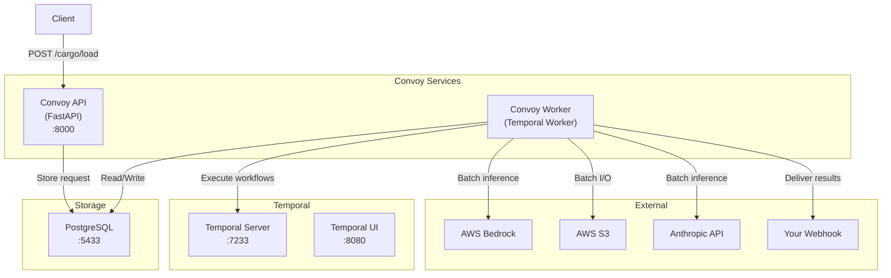
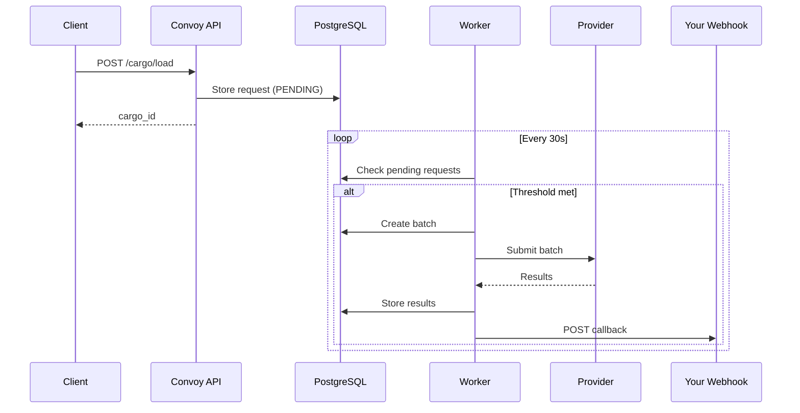

# Architecture

## System Overview

## Components

### Convoy API

FastAPI application handling:
- Request submission (`POST /cargo/load`)
- Status tracking (`GET /cargo/{id}/tracking`)
- Health checks (`GET /health`)

### Convoy Worker

Temporal worker running three workflows:

| Workflow | Purpose |
|----------|---------|
| `BatchSchedulerWorkflow` | Monitors pending requests, creates batches, submits to providers |
| `CallbackDeliveryWorkflow` | Delivers results to callback URLs with retry |
| `ResultCleanupWorkflow` | Removes expired results (default: 30 days) |

### Temporal

Workflow orchestration engine providing:
- Durable execution
- Automatic retries
- Workflow history and visibility

### PostgreSQL

Stores:
- Cargo requests
- Batch jobs
- Processing results
- Callback delivery status

## Data Flow

## Database Schema

### cargo_requests
| Column | Type | Description |
|--------|------|-------------|
| `id` | UUID | Primary key |
| `cargo_id` | string | Public identifier |
| `provider` | enum | bedrock, anthropic |
| `model` | string | Model identifier |
| `params` | JSONB | Request parameters |
| `callback_url` | string | Delivery URL |
| `status` | enum | Current status |
| `batch_job_id` | UUID | Associated batch |

### batch_jobs
| Column | Type | Description |
|--------|------|-------------|
| `id` | UUID | Primary key |
| `provider` | enum | bedrock, anthropic |
| `provider_job_id` | string | External job ID |
| `status` | enum | Batch status |
| `request_count` | int | Requests in batch |

### cargo_results
| Column | Type | Description |
|--------|------|-------------|
| `id` | UUID | Primary key |
| `cargo_request_id` | UUID | Parent request |
| `success` | bool | Processing success |
| `response` | JSONB | Model response |
| `expires_at` | timestamp | Cleanup date |

### callback_deliveries
| Column | Type | Description |
|--------|------|-------------|
| `id` | UUID | Primary key |
| `cargo_request_id` | UUID | Parent request |
| `status` | enum | Delivery status |
| `attempt_count` | int | Delivery attempts |
