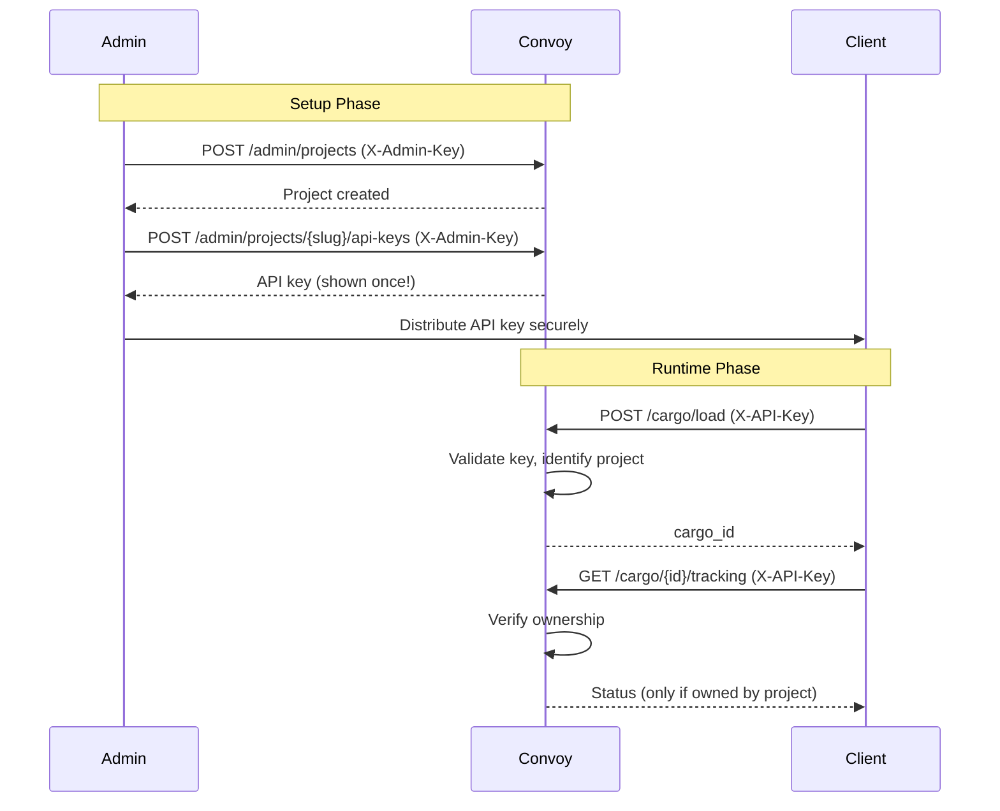

# Authentication

Convoy uses a two-tier authentication system to provide secure, multi-tenant access to the batch processing API.

import { Callout } from 'nextra/components'

## Overview

| Auth Type | Header | Purpose |
|-----------|--------|---------|
| Admin | `X-Admin-Key` | Manage projects and API keys |
| Project | `X-API-Key` | Submit and track cargo requests |

## Projects

Projects provide multi-tenant isolation in Convoy. Each project:

- Has a unique **slug** (e.g., `my-project`) for identification
- Contains its own set of **API keys**
- Owns its **cargo requests** — requests are scoped to the project that created them
- Can be **activated/deactivated** without deleting data

### Project Structure

```json
{
  "id": "550e8400-e29b-41d4-a716-446655440000",
  "name": "Production App",
  "slug": "production-app",
  "description": "Main production workloads",
  "is_active": true,
  "created_at": "2024-01-15T10:30:00Z"
}
```

## API Keys

API keys authenticate requests to the cargo operations endpoints (`/cargo/load`, `/cargo/{id}/tracking`).

### Key Format

Keys follow the format: `convoy_sk_` followed by 32 random characters.

```
convoy_sk_7kX9mP2nQ4rT6vW8yB0cD3fG5hJ
└──────┘ └────────────────────────────┘
 prefix          random part
```

### Key Lifecycle

1. **Creation** — Admin creates key via `/admin/projects/{slug}/api-keys`
2. **Distribution** — Full key shown **once** at creation; store securely
3. **Usage** — Include in `X-API-Key` header for cargo operations
4. **Tracking** — `last_used_at` updated on each use
5. **Expiration** — Optional expiration date
6. **Revocation** — Admin can deactivate keys without deletion

<Callout type="warning">
  **Security Note**: API keys are stored as SHA-256 hashes. The full key cannot be retrieved after creation.
</Callout>

### Key Properties

| Property | Description |
|----------|-------------|
| `name` | Human-readable identifier (e.g., "Production", "Development") |
| `key_prefix` | First 12 characters for identification |
| `is_active` | Whether the key can be used |
| `expires_at` | Optional expiration timestamp |
| `last_used_at` | Last successful authentication |

## Admin Authentication

Admin operations require the `X-Admin-Key` header with the value from your `ADMIN_API_KEY` environment variable.

```bash
curl -X POST http://localhost:8000/admin/projects \
  -H "Content-Type: application/json" \
  -H "X-Admin-Key: your-admin-key" \
  -d '{"name": "My Project", "slug": "my-project"}'
```

### Admin Endpoints

| Method | Endpoint | Description |
|--------|----------|-------------|
| `POST` | `/admin/projects` | Create project |
| `GET` | `/admin/projects` | List projects |
| `GET` | `/admin/projects/{slug}` | Get project |
| `PATCH` | `/admin/projects/{slug}` | Update project |
| `POST` | `/admin/projects/{slug}/api-keys` | Create API key |
| `GET` | `/admin/projects/{slug}/api-keys` | List API keys |
| `DELETE` | `/admin/projects/{slug}/api-keys/{id}` | Revoke API key |

See [Admin API Reference](/api/admin) for complete documentation.

## Project Authentication

Cargo operations require the `X-API-Key` header with a valid project API key.

```bash
curl -X POST http://localhost:8000/cargo/load \
  -H "Content-Type: application/json" \
  -H "X-API-Key: convoy_sk_your_key_here" \
  -d '{
    "params": {"model": "claude-sonnet-4-5", "messages": [...]},
    "callback_url": "https://example.com/callback"
  }'
```

### Project Endpoints

| Method | Endpoint | Description |
|--------|----------|-------------|
| `POST` | `/cargo/load` | Submit request for batch processing |
| `GET` | `/cargo/{cargo_id}/tracking` | Get request status |

## Authentication Flow



## Error Responses

### 401 Unauthorized

Returned when authentication fails:

```json
{"detail": "API key required. Include X-API-Key header."}
{"detail": "Invalid API key format."}
{"detail": "Invalid API key."}
{"detail": "API key has expired."}
```

### 403 Forbidden

Returned when the project is inactive:

```json
{"detail": "Project is inactive."}
```

### 404 Not Found

Returned when accessing cargo not owned by the authenticated project:

```json
{"detail": "Cargo not found"}
```

## Best Practices

1. **Use separate keys per environment** — Create distinct keys for development, staging, and production
2. **Set expiration dates** — For temporary access or contractor keys
3. **Rotate keys periodically** — Create new key, update clients, revoke old key
4. **Monitor usage** — Check `last_used_at` to identify unused keys
5. **Secure admin key** — Store `ADMIN_API_KEY` in secrets management, not in code
6. **Use HTTPS** — Always use TLS in production to protect keys in transit
