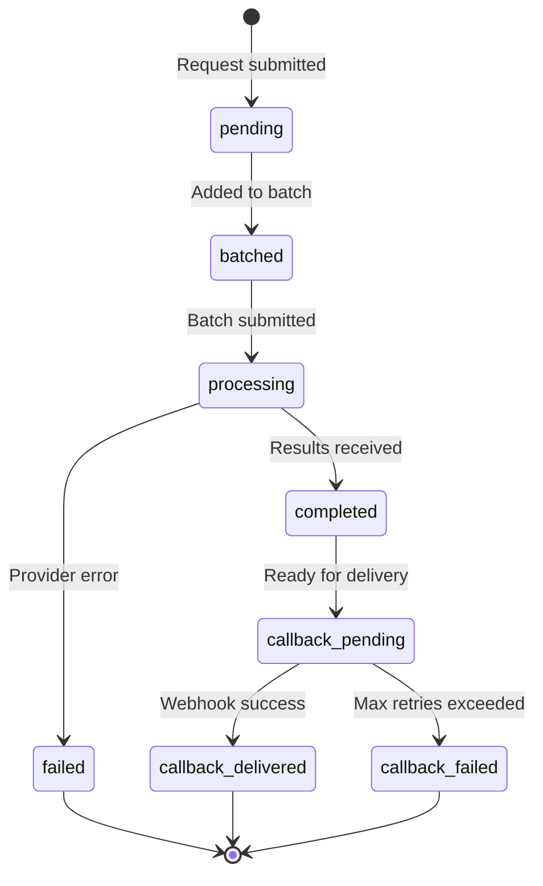

# Cargo Lifecycle

Every request (cargo) goes through a series of status transitions.

## Status Flow



## Status Descriptions

| Status | Description |
|--------|-------------|
| `pending` | Waiting to be assigned to a batch |
| `batched` | Assigned to a batch job, waiting for submission |
| `processing` | Batch submitted to provider, awaiting results |
| `completed` | Provider returned results |
| `failed` | Provider returned an error |
| `callback_pending` | Result ready, callback delivery in progress |
| `callback_delivered` | Callback successfully delivered |
| `callback_failed` | Callback delivery failed after all retries |

## Batching Logic

Requests are batched when either threshold is met:

| Threshold | Default | Config Variable |
|-----------|---------|-----------------|
| Request count | 100 | `BATCH_SIZE_THRESHOLD` |
| Time elapsed | 1 hour | `BATCH_TIME_THRESHOLD_SECONDS` |

The worker checks for pending requests every 30 seconds (`BATCH_CHECK_INTERVAL_SECONDS`).

## Timeline Example

```
T+0s     Request submitted           → pending
T+30s    Worker checks, not enough   → pending
T+60s    100 requests reached        → batched
T+61s    Batch submitted to Bedrock  → processing
T+5min   Bedrock completes           → completed
T+5min   Callback delivery starts    → callback_pending
T+5min   Webhook receives result     → callback_delivered
```

## Terminal States

These statuses indicate the request is complete:

- `callback_delivered` - Success, result delivered
- `callback_failed` - Result ready but delivery failed
- `failed` - Provider processing failed
