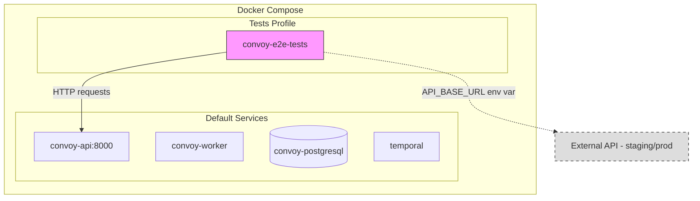
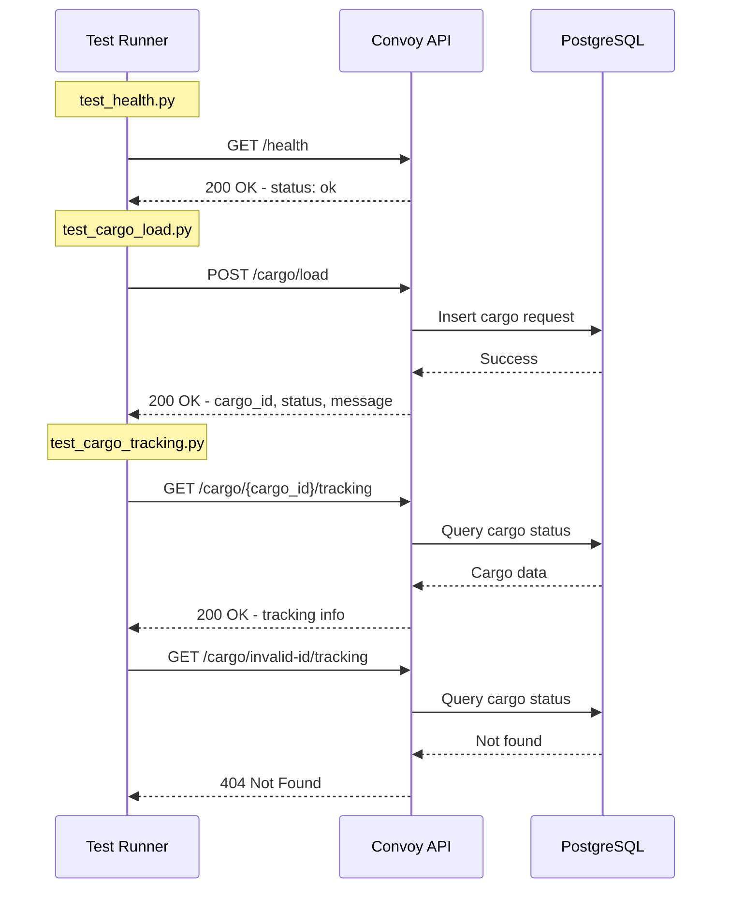

# E2E Tests Setup Plan for Convoy App

## Overview

This plan outlines the implementation of end-to-end (E2E) tests for the Convoy API application. The tests will be:
- Implemented using **pytest** with **httpx** for async HTTP testing
- Located in a separate `tests/` directory at the project root
- Runnable via Docker using a dedicated **`tests` profile**
- Configurable via environment variable `API_BASE_URL` to support testing against different environments (local, staging, production)

## Architecture



## Directory Structure

```
convoy/
├── tests/                          # NEW: E2E tests directory
│   ├── __init__.py
│   ├── conftest.py                 # Pytest fixtures and configuration
│   ├── pyproject.toml              # Test dependencies
│   ├── Dockerfile                  # Docker image for running tests
│   ├── test_health.py              # Health endpoint tests
│   ├── test_cargo_load.py          # Cargo load endpoint tests
│   └── test_cargo_tracking.py      # Cargo tracking endpoint tests
├── compose.yaml                    # Updated with tests profile
├── .env.example                    # Updated with E2E test env vars
└── ... existing files
```

## Implementation Details

### 1. Test Dependencies - `tests/pyproject.toml`

```toml
[project]
name = "convoy-e2e-tests"
version = "0.1.0"
description = "E2E tests for Convoy API"
requires-python = ">=3.12"
dependencies = [
    "pytest>=8.0.0",
    "pytest-asyncio>=0.24.0",
    "httpx>=0.28.0",
]
```

### 2. Pytest Configuration - `tests/conftest.py`

The conftest will provide:
- `api_base_url` fixture reading from `API_BASE_URL` environment variable
- `async_client` fixture providing an httpx AsyncClient configured with the base URL
- Default timeout configuration for HTTP requests

```python
import os
import pytest
import httpx

@pytest.fixture(scope="session")
def api_base_url() -> str:
    """Get API base URL from environment variable."""
    url = os.environ.get("API_BASE_URL", "http://localhost:8000")
    return url.rstrip("/")

@pytest.fixture
async def async_client(api_base_url: str):
    """Provide an async HTTP client configured with the API base URL."""
    async with httpx.AsyncClient(
        base_url=api_base_url,
        timeout=30.0
    ) as client:
        yield client
```

### 3. Test Files

#### `test_health.py` - Health Check Endpoint
- `GET /health` returns 200 OK
- Response contains `{"status": "ok"}`

#### `test_cargo_load.py` - Cargo Load Endpoint
- `POST /cargo/load` with valid payload returns 200 OK
- Response contains `cargo_id`, `status`, and `message`
- Invalid payload returns appropriate error response

#### `test_cargo_tracking.py` - Cargo Tracking Endpoint
- `GET /cargo/{cargo_id}/tracking` returns tracking info for valid cargo
- Returns 404 for non-existent cargo_id
- Response contains expected fields: `cargo_id`, `status`, `status_description`, `created_at`, `updated_at`

### 4. Dockerfile for Tests - `tests/Dockerfile`

```dockerfile
FROM ghcr.io/astral-sh/uv:python3.12-bookworm-slim

ENV PYTHONDONTWRITEBYTECODE=1
ENV PYTHONUNBUFFERED=1

WORKDIR /tests

COPY pyproject.toml ./
RUN uv sync --frozen --no-cache

COPY . .

# Default command runs all tests
CMD ["uv", "run", "pytest", "-v", "--tb=short"]
```

### 5. Docker Compose Profile Update - `compose.yaml`

Add a new service with the `tests` profile:

```yaml
services:
  # ... existing services ...

  convoy-e2e-tests:
    container_name: convoy-e2e-tests
    profiles:
      - tests
    build:
      context: ./tests
      dockerfile: Dockerfile
    environment:
      - API_BASE_URL=${API_BASE_URL:-http://convoy-api:8000}
    depends_on:
      convoy-api:
        condition: service_started
    networks:
      - temporal-network
```

### 6. Environment Variables Update - `.env.example`

Add:
```env
# E2E Test Configuration
API_BASE_URL=http://convoy-api:8000
```

## Usage

### Running E2E Tests Locally with Docker

```bash
# Run tests against local Docker environment
docker compose --profile tests up --build convoy-e2e-tests

# Or run with specific API URL for staging/production
API_BASE_URL=https://api.staging.convoy.example.com docker compose --profile tests up --build convoy-e2e-tests
```

### Running E2E Tests Without Docker

```bash
cd tests
export API_BASE_URL=http://localhost:8000
uv run pytest -v
```

### Running Against Different Environments

| Environment | Command |
|-------------|---------|
| Local Docker | `docker compose --profile tests up convoy-e2e-tests` |
| Local Dev | `API_BASE_URL=http://localhost:8000 uv run pytest` |
| Staging | `API_BASE_URL=https://staging-api.convoy.com docker compose --profile tests up convoy-e2e-tests` |
| Production | `API_BASE_URL=https://api.convoy.com docker compose --profile tests up convoy-e2e-tests` |

## Test Flow Diagram



## Files to Create/Modify

| File | Action | Description |
|------|--------|-------------|
| `tests/__init__.py` | Create | Empty init file for Python package |
| `tests/pyproject.toml` | Create | Test dependencies configuration |
| `tests/conftest.py` | Create | Pytest fixtures and configuration |
| `tests/Dockerfile` | Create | Docker image for test runner |
| `tests/test_health.py` | Create | Health endpoint tests |
| `tests/test_cargo_load.py` | Create | Cargo load endpoint tests |
| `tests/test_cargo_tracking.py` | Create | Cargo tracking endpoint tests |
| `compose.yaml` | Modify | Add convoy-e2e-tests service with tests profile |
| `.env.example` | Modify | Add API_BASE_URL variable |

## Success Criteria

1. All E2E tests pass when run against local Docker environment
2. Tests can be run using `docker compose --profile tests up convoy-e2e-tests`
3. Tests do NOT run with default `docker compose up` command
4. `API_BASE_URL` environment variable allows targeting different environments
5. Test output is visible in Docker logs
6. Tests exit with appropriate exit code (0 for success, non-zero for failure)
